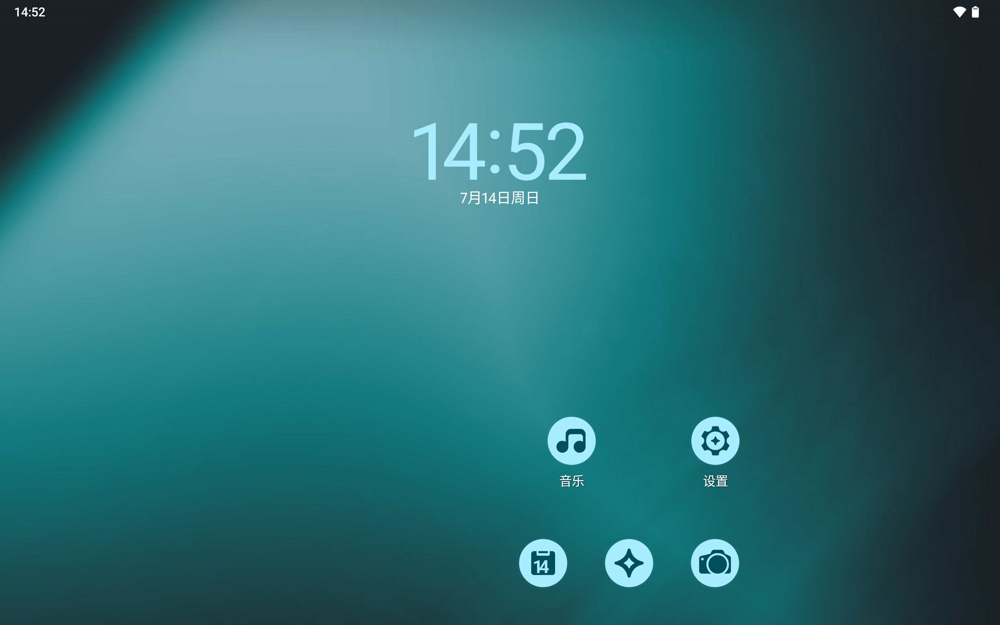
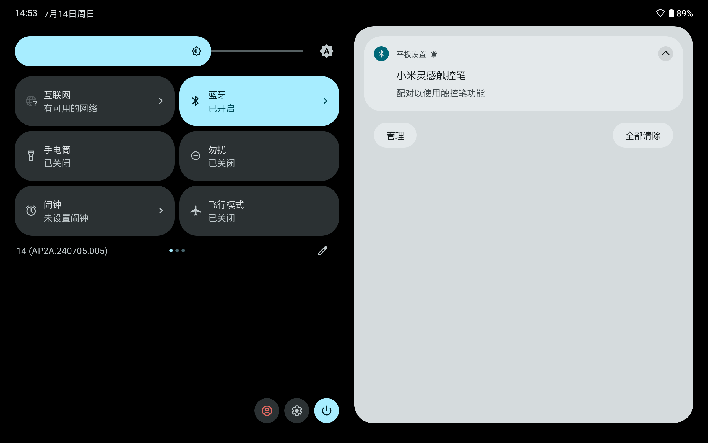
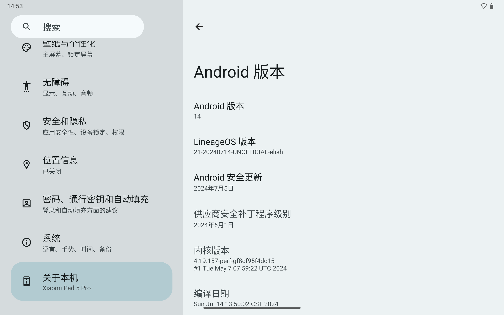

# android_device_xiaomi_elish

Xiaomi Pad 5 Pro (elish) Device Tree for Android 14 LineageOS 21.0

## How to flash

You will lose all user data after flashing LineageOS. Remember to back it up in a safe place. I warned you.
   
1. Unlock your bootloader & Flash HyperOS 1.0.2.0.TKYCNXM first
2. Download boot.img vendor_boot.img and lineage-version-code-UNOFFICIAL-elish.zip from GitHub release
3. Reboot to bootloader mode, flash boot and vendor_boot by `fastboot flash boot boot.img && fastboot flash vendor_boot vendor_boot.img`
4. Reboot to recovery mode, do Factory reset, click "Apply update -> Apply from ADB" and `adb sideload lineage-<version code>-UNOFFICIAL-elish.zip`
5. Reboot

## Screenshots

